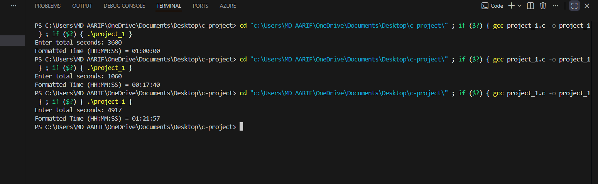

# Time Conversion Tool (C Mini Project)

## Introduction
This project is a simple Time Conversion Tool developed using the C programming language.  
The main purpose of this project is to convert a given time in seconds into a standard time format of hours, minutes, and seconds (HH:MM:SS).

This mini project is designed especially for beginners to understand how logical calculations and basic programming concepts work in real-life problems.

## Why I Chose This Project
I selected this project because time conversion is a common and practical problem in daily life.  
While working on this project, I wanted to strengthen my understanding of:
- Basic arithmetic operations
- Conditional thinking
- Input and output handling in C
- Formatting output in a clean and readable way

This project also helped me gain confidence in building small but meaningful programs on my own.

## Project Objective
The objective of this project is:
- To take total seconds as input from the user
- To convert the given seconds into hours, minutes, and seconds
- To display the result in a proper HH:MM:SS format

## Technology and Tools Used
- Programming Language: C
- Compiler: GCC / Turbo C
- Code Editor: VS Code
- Operating System: Windows

## How the Program Works
1. The program asks the user to enter the total number of seconds.
2. It calculates the number of hours by dividing seconds by 3600.
3. The remaining seconds are used to calculate minutes.
4. The final remaining value is taken as seconds.
5. The output is displayed in HH:MM:SS format.
   
## Sample Input
1. 3600
2. 1060
3. 4917

## Sample Output
1. 01:00:00
2. 00:17:40
3. 01:21:57

## Utility of the Project
This project can be useful in:
- Learning time-based calculations
- Understanding real-world applications of C programming
- Building basic digital clock logic
- Academic mini project submission

## Future Scope
This project can be further improved in the future by:
- Adding conversion for days along with hours
- Creating a menu-driven version
- Taking time in HH:MM:SS format and converting it back to seconds
- Adding input validation for negative values
- Developing a GUI-based version of the project

## Learning Outcome
Through this project, I learned:
- How to break a problem into smaller logical steps
- How to work with arithmetic operations efficiently
- How to format output properly in C
- How to build confidence in writing complete programs

## Author
**Aarif**  
B.Tech CSE (Artificial Intelligence)  
Mini Project – C Programming

## Conclusion
The Time Conversion Tool is a simple yet effective mini project that demonstrates the practical use of C programming concepts.  
It is beginner-friendly and helps in understanding how programming logic can solve real-life problems efficiently.
